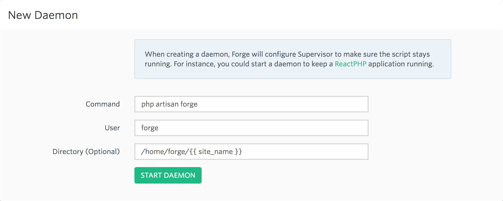

# Production

## Forge deployment

When deploying applications with [Laravel Forge](https://forge.laravel.com) for the first time, do not select *Install Composer Dependencies*.

Be sure to keep any of your production environment configuration variables up to date in the [`.env.production.example` file](https://github.com/michaeldyrynda/founder/blob/master/.env.production.example), which you can copy into your application's environment using the Forge interface. Remember, **no sensitive configuration should be added to this, or any other file, in version control.**

It is useful to store production-specific configuration in `.env.production.example`, such as defining your cache and session drivers as `redis` instead of `file` or that debug should be disabled.

The following deployment script should be used on a PHP 7.3 host, and can be executed once the application repository has been installed by clicking on the *Deploy Now* button.

```bash
cd /home/forge/{{ site_name }}
git pull origin main
composer install --no-interaction --prefer-dist --optimize-autoloader --no-scripts
npm ci -s --no-progress
npm run prod -s --no-progress

if [ -f artisan ]
then
    php artisan migrate --force
    php artisan view:clear
    php artisan cache:clear
    php artisan config:cache
    php artisan route:cache
    php artisan storage:link
    # If using Laravel Horizon
    # php artisan horizon:terminate
fi

( flock -w 10 9 || exit 1
    echo 'Restarting FPM...'; sudo -S service $FORGE_PHP_FPM reload ) 9>/tmp/fpmlock
```

## Laravel Horizon

All Forge-managed servers ship with Redis running by default. Using Horizon to manage your queues, you will also get a dashboard, which you can use to monitor and retry your application jobs with ease.

The default configuration for Horizon - found in `config/horizon.php` - should be suitable in most instances. Consult the Horizon [documentation](https://laravel.com/docs/5.5/horizon) should changes be necessary.

In a default Horizon installation, the dashboard will be unavailable in production. Founder modifies this behaviour to allow any authenticated user access to the dashboard. This should be reviewed on a per-application basis in the [`app/Providers/AppServiceProvider.php` file](https://github.com/michaeldyrynda/founder/blob/master/app/Providers/AppServiceProvider.php).

Once your application has been installed, be sure to set up the daemon which keeps the Horizon service is running.

Go to your server in Forge and click on *Daemons*.



The `php artisan horizon:terminate` command that is part of the deployment script will handle gracefully terminating and restarting Horizon on each deployment.
